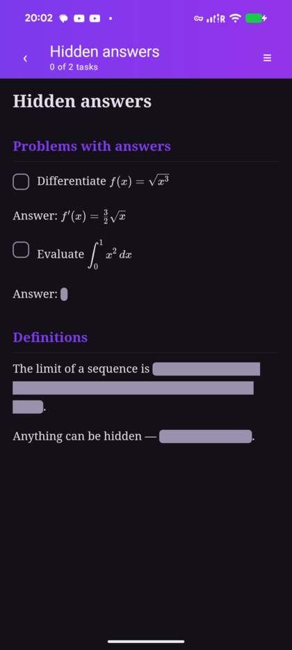
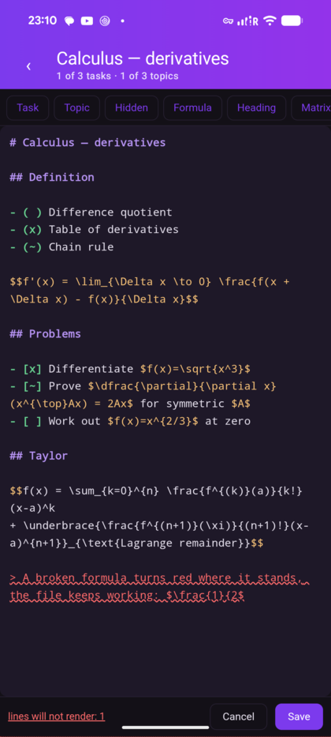
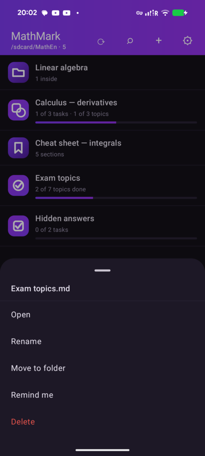
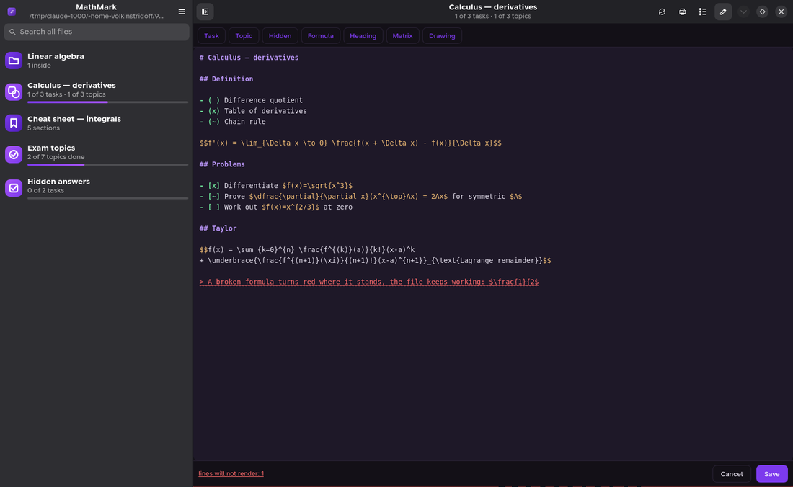
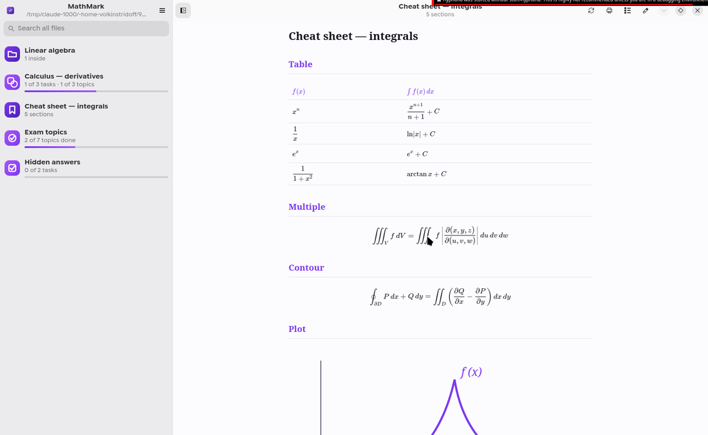
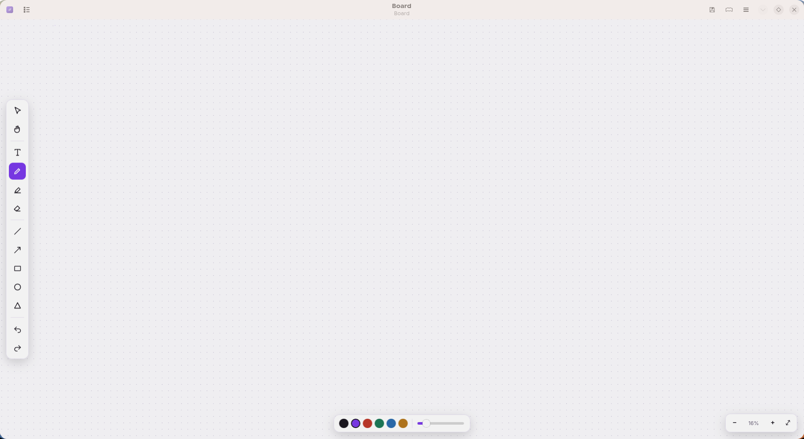
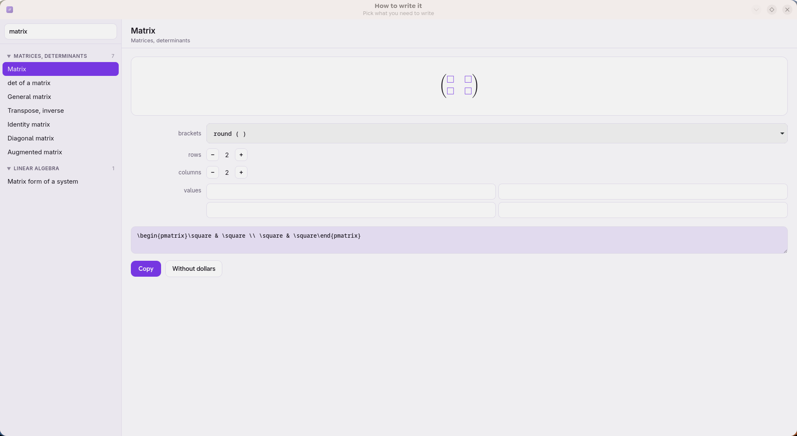

<div align="center">


# MathMark

**Un lector de matemáticas escritas en Markdown — para el móvil y para el escritorio.**

Las fórmulas se ven como en los libros de texto.
Marcar una tarea cambia exactamente un byte del archivo.

[English](README.md) · [Русский](README.ru.md)

[Qué cambió en cada versión](CHANGELOG.es.md)

  


</div>

---

> **Obsidian es una base de conocimiento que además dibuja fórmulas. Esto es un
> registro del avance en matemáticas que vive dentro de tus propios archivos.**
> Si lo que necesitas es una base de conocimiento, usa Obsidian: lo hace bien.

## Por qué

Las matemáticas son cómodas de **escribir** como texto plano — a mano o con un modelo de lenguaje. Lo que falla es leerlas después.

Los lectores de Markdown corrientes muestran `\int_0^1 \frac{dx}{x}` como una fila de barras invertidas. Los sistemas de notas como Obsidian o Joplin sí dibujan fórmulas, pero quieren adueñarse de tus notas: un almacén, una base de datos, una cuenta. Un PDF hecho con LaTeX está compuesto para una hoja A4 — en el móvil te pasas la vida ampliando y arrastrando.

MathMark hace dos cosas y se niega a hacer más: **mostrar las matemáticas como es debido y dejarte marcar lo hecho.**

## Descargar

| | |
|---|---|
| **Android** | [Releases](../../releases) → el archivo `.apk` |
| **Arch Linux** | `yay -S mathmark` — [AUR](https://aur.archlinux.org/packages/mathmark) |
| **Cualquier Linux** | [Releases](../../releases) → el archivo `.flatpak`, es el único, se instala con `flatpak install ./mathmark-*.flatpak` |
| **Desde el código** | ver [Escritorio](#escritorio) |

Sin cuenta, sin red, sin telemetría. El motor de fórmulas viaja dentro de la aplicación.

## Cómo es un archivo

Markdown corriente. Fórmulas en LaTeX entre signos de dólar.

```markdown
# Cálculo — derivadas

## Temas

- ( ) Cociente incremental
- (x) Tabla de derivadas
- (~) Regla de la cadena

$$f'(x) = \lim_{\Delta x \to 0} \frac{f(x + \Delta x) - f(x)}{\Delta x}$$

## Ejercicios

- [x] Derivar $f(x)=\sqrt{x^3}$
- [ ] Demostrar $\dfrac{\partial}{\partial x}(x^{\top}Ax) = 2Ax$

La respuesta se puede ocultar: ||$f'(x) = \tfrac{3}{2}\sqrt{x}$|| — toca para verla.
```

**Los corchetes tienen significado.**
`[ ]` es un **ejercicio**: se hace una vez, y al terminarlo queda tachado.
`( )` es un **tema**: se estudia, y un tema terminado **no** se tacha, solo se atenúa. El conocimiento no se tacha.

Ambos tienen **tres estados**: `[ ]` sin empezar, `[~]` en marcha, `[x]` hecho. Al tocar la marca van rotando.

Nunca declaras qué es un archivo. La aplicación cuenta las líneas y elige el icono sola: lista de ejercicios, lista de temas, mezcla, o una hoja de consulta.

## Qué hace

<div align="center">
    
</div>

- **Fórmulas de verdad.** Fracciones, raíces de cualquier índice, integrales múltiples y de contorno, sumas y productos con límites, matrices y determinantes, sistemas, desarrollos alineados, letras griegas, símbolos de conjuntos y lógica, índices tensoriales, fracciones continuas, llaves bajo un grupo de términos. Las dibuja [KaTeX](https://katex.org) en Computer Modern — la tipografía de los libros de matemáticas.
- **Texto oculto.** Envuelve lo que quieras en `||barras dobles||` y se convierte en una placa que se abre al tocarla. Respuestas, pistas, definiciones — lo que quieras recordar antes de mirar.
- **Edición dentro de la aplicación.** Un botón con lápiz convierte la página en texto plano con colores: títulos, marcas, fórmulas, texto oculto y dibujos, cada uno con el suyo. Las fórmulas rotas se subrayan **mientras escribes**, y la comprobación la hace el propio motor de fórmulas, así que es exacta. Botones e instrucciones con barra (`/int`, `/matrix`, `/sigma`, cuarenta en total) insertan LaTeX que no se puede teclear. Se guarda exactamente lo que escribiste, byte a byte.
- **Búsqueda en todos los archivos**, por nombre y por contenido, mostrando la línea que coincide.
- **Índice** a partir de los títulos `##` — así se recorre una chuleta larga.
- **Progreso.** Cuánto cerraste hoy, esta semana, este mes, cuántos días seguidos, y un gráfico de treinta días. Se cuenta desde un diario de marcas, así que registra **cuándo lo resolviste**, no cuándo sincronizaste.
- **Recordatorios** colgados de un archivo, nunca escritos dentro de él. Tu propio texto, cada día / cada semana / una vez. Al tocar la notificación se abre ese archivo.
- **Sincronización por GitHub**, con un botón. Las marcas hechas en dos dispositivos se combinan y gana el estado más avanzado. Un conflicto real de texto nunca se resuelve a tus espaldas: tu versión se queda y la otra se guarda al lado.
- **Dibujos** como `<svg>` incrustado, para que la gráfica viaje dentro del propio archivo.
- **Una pizarra y un asistente de escritura** — una hoja punteada infinita sobre la que pensar y un constructor que teclea el LaTeX por ti: eliges una matriz, rellenas las casillas, copias. Solo en el escritorio, [descrito más abajo](#la-pizarra).
- **Tres idiomas**: English, Русский, Español.

## La regla de la que nace todo lo demás

La aplicación **nunca reescribe tu archivo.** Al marcar busca la posición exacta del carácter entre los corchetes y sustituye ese único byte: espacio → `~` → `x` → espacio. Todos los demás bytes — sangrías, líneas en blanco, mayúsculas, el orden de las líneas — quedan intactos, y la longitud del archivo no cambia.

Esto importa si además editas esos archivos desde una terminal, un editor o un asistente. Un programa que interpretara el archivo y lo volviera a escribir normalizaría tu formato y desharía en silencio el trabajo hecho en otro sitio.

La lógica vive en `MdItems.kt` y `md_items.py` y está cubierta por pruebas — incluida una que comprueba que tras marcar difiere exactamente un byte en UTF-8.

## Nada está oculto a la terminal

No hay base de datos. Todo lo que la aplicación sabe vive en archivos que puedes leer y editar:

| Qué | Dónde |
|---|---|
| marcas | dentro de tus propios `.md` |
| ajustes | `~/.config/mathmark/mathmark.conf`, texto plano |
| la lista de archivos | la carpeta misma, no hay registro interno |
| diario de marcas | `journal.log`, solo se añade |
| recordatorios | `reminders.conf`, texto plano |

Así que todo lo que puedes hacer a mano lo puede hacer también un script o un asistente desde la terminal — y al revés. Edita un archivo por fuera y el documento abierto se recarga solo.

La aplicación además entrega su propia guía de formato cuando se la piden:

```bash
content query --uri content://dev.yury.mathmark/prompt
```

En el escritorio ese mismo texto está bajo un botón en los ajustes. Explica los corchetes, los tres estados, el texto oculto, las fórmulas y los dibujos — dáselo a un modelo de lenguaje y los archivos que escriba se verán bien a la primera.

## Escritorio

<div align="center">
 

 
</div>

La versión de escritorio es el mismo programa y dibuja **con la misma página** que el móvil: `shared/reader/` lo usan las dos, así que no pueden separarse.

Lo que añade la pantalla grande: dos paneles, búsqueda en todos los archivos, teclado (`j`/`k` o flechas para moverse, espacio para marcar), impresión y guardado de una chuleta en PDF, y vigilancia de la carpeta — editas un archivo en tu editor y la ventana se actualiza sola. La columna de texto mantiene un ancho legible: al ensanchar la ventana crecen los márgenes, no la línea.

### La pizarra

<div align="center"></div>

Una segunda ventana (`Ctrl+D`): una hoja infinita punteada — el papel sobre el que se piensa, no la página que se lee. Pluma, marcador, goma, rectas, flechas, rectángulos, elipses, triángulos. Doble clic en cualquier sitio y escribes un rótulo; doble clic encima y lo corriges. Copiar, pegar, duplicar, deshacer. La hoja se desplaza y se acerca, y la retícula de puntos cambia de densidad por escalones: al alejarse los puntos no se apelmazan y al acercarse no se separan.

La pizarra se guarda como JSON legible en la misma carpeta que tus apuntes, con un nombre acabado en `.board`. La misma regla que rige todo aquí: nada queda encerrado dentro del programa.

### «Cómo se escribe»

<div align="center"></div>

Lo que detiene a la gente no es *qué* escribir, sino *cómo se teclea eso*. Pulsa `Ctrl+M`: eliges una fracción, una integral, una matriz, un sistema — **115 entradas en 18 secciones** — y aparece ya dibujada, con casillas vacías donde van tus números. Rellenas las casillas, pulsas Copiar y lo pegas donde haga falta.

Cada entrada trae sus propios ajustes: la matriz pide corchetes, filas y columnas, y ofrece una rejilla de campos para los valores; el vector, su dimensión y si va en fila o en columna; la integral, sus límites y su variable. La búsqueda funciona en inglés, ruso y español a la vez, tanto por nombre como por palabras clave. Un segundo botón copia el LaTeX sin los signos de dólar, para pegarlo dentro de una fórmula que ya tengas.

Tanto la pizarra como el asistente existen solo en el escritorio, a propósito.

En Arch basta un comando:

```bash
yay -S mathmark
```

En cualquier otro sistema, directamente desde el código:

```bash
./desktop/install.sh     # lanzador en ~/.local/bin, icono y entrada de menú
mathmark
```

Necesita `gtk4`, `libadwaita`, `webkitgtk-6.0`, `python-gobject`.

## Compilar

**Android** — JDK 21 y el SDK de Android (plataforma 37):

```bash
cd android
gradle :app:testDebugUnitTest
gradle :app:assembleRelease
adb install -r app/build/outputs/apk/release/app-release.apk
```

La aplicación lee una carpeta corriente del almacenamiento compartido, así que pide una vez acceso a todos los archivos. Con root se le puede conceder en silencio:

```bash
adb shell 'su -c "appops set io.github.volkinstridov.MathMark MANAGE_EXTERNAL_STORAGE allow"'
```

**Escritorio** — `python3 -m pytest desktop/tests`

Ambos lados llevan las mismas 51 pruebas: reglas idénticas de análisis, marcado, combinación, estadísticas y recordatorios. Si las dos implementaciones discrepan, las pruebas fallan.

## Estructura

```
shared/          común a las dos versiones
  reader/        la página de lectura, su tipografía y KaTeX
  prompt/        la guía de formato para modelos de lenguaje
  i18n/          traducciones, un JSON por idioma
android/         Kotlin, Jetpack Compose
desktop/         Python, GTK4, libadwaita
```

## Contacto

Si algo se rompe o falta algo — [abre una incidencia](https://github.com/VolkinstridoV/mathmark/issues).
Si prefieres escribir directamente, el autor está en Telegram: [@Volkinstridoff](https://t.me/Volkinstridoff).

## Licencia

MIT. Haz con ello lo que quieras.
