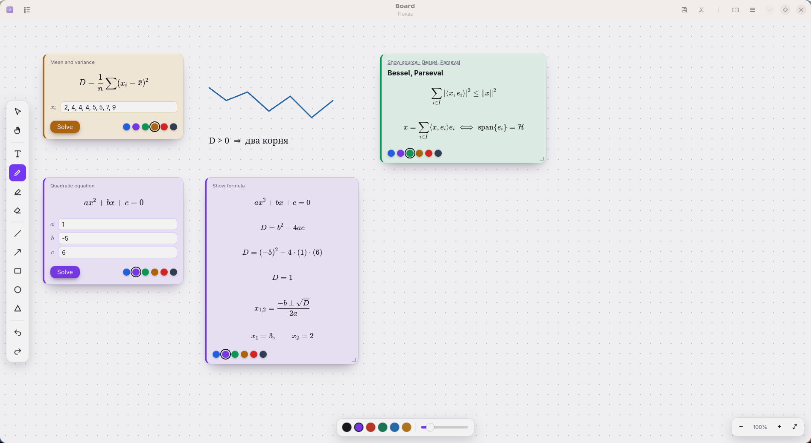
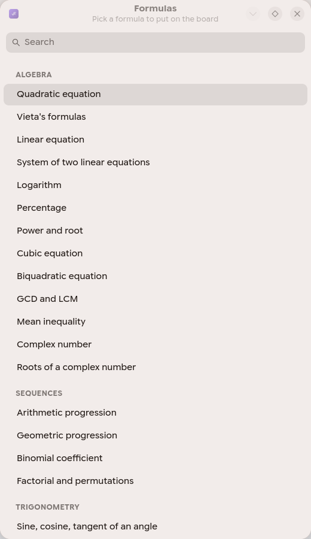

<div align="center">


# MathMark

**A reader for maths written in Markdown — for the phone and the desktop.**

Formulas look the way they look in textbooks.
Marking a task changes exactly one byte in your file.

[Русский](README.ru.md) · [Español](README.es.md)

[What changed in every version](CHANGELOG.md)

  


</div>

---

> **Obsidian is a knowledge base that also renders formulas. This is a tracker for
> going through maths, living inside your own files.** If a knowledge base is what
> you need — take Obsidian, it is good at that.

## Why

Maths is comfortable to *write* as plain text — by hand or with a language model. Reading it back is where it falls apart.

Plain Markdown readers show `\int_0^1 \frac{dx}{x}` as a row of backslashes. Note systems like Obsidian or Joplin do render formulas, but they want to own your notes: a vault, a database, an account. A PDF built from LaTeX is typeset for a sheet of A4 — on a phone you pinch and drag it forever.

MathMark does two things and refuses to do more: **show the maths properly, and let you mark what you have done.**

## Download

| | |
|---|---|
| **Android** | [Releases](../../releases) → the `.apk` file |
| **Arch Linux** | `yay -S mathmark` — [AUR](https://aur.archlinux.org/packages/mathmark) |
| **Any Linux** | [Releases](../../releases) → the `.flatpak` file, just the one, installs with `flatpak install ./mathmark-*.flatpak` |
| **From source** | see [Desktop](#desktop) below |

No account, no network, no telemetry. The formula engine ships inside the app.

## How a file looks

Ordinary Markdown. Formulas in LaTeX between dollar signs.

```markdown
# Calculus — derivatives

## Topics

- ( ) Difference quotient
- (x) Table of derivatives
- (~) Chain rule

$$f'(x) = \lim_{\Delta x \to 0} \frac{f(x + \Delta x) - f(x)}{\Delta x}$$

## Problems

- [x] Differentiate $f(x)=\sqrt{x^3}$
- [ ] Prove $\dfrac{\partial}{\partial x}(x^{\top}Ax) = 2Ax$

The answer can be hidden: ||$f'(x) = \tfrac{3}{2}\sqrt{x}$|| — tap to reveal.
```

**The brackets carry meaning.**
`[ ]` is a **problem** — you do it once, and a finished one gets struck through.
`( )` is a **topic** — you study it, and a finished topic is *not* struck through, it only dims. Knowledge does not get crossed out.

Both have **three states**: `[ ]` untouched, `[~]` in progress, `[x]` done. Tapping the mark cycles them.

You never declare what a file is. The app counts the lines and picks the icon itself: problem list, topic list, both, or a reference sheet.

## What it does

<div align="center">
    
</div>

- **Formulas, properly.** Fractions, roots of any degree, multiple and contour integrals, sums and products with limits, matrices and determinants, systems, aligned derivations, Greek letters, set and logic symbols, tensor indices, continued fractions, braces under a group of terms. Rendered by [KaTeX](https://katex.org) in Computer Modern — the typeface your textbooks are set in.
- **Hidden text.** Wrap anything in `||double bars||` and it becomes a plate you tap to reveal. Answers, hints, definitions — whatever you want to recall before you peek.
- **Editing inside the app.** A pencil button turns the page into plain text with colours: headings, marks, formulas, hidden parts and drawings each get their own. Broken formulas are underlined **while you type** — the check asks the formula engine itself, so it is exact. Insert buttons and slash commands (`/int`, `/matrix`, `/sigma` — forty of them) put in LaTeX you cannot type on a keyboard. What you typed is saved byte for byte; nothing is reformatted.
- **Search across every file**, by name and by content, showing the line that matched.
- **Table of contents** built from `##` headings — how you navigate a long cheat sheet.
- **Progress.** What you closed today, this week, this month, how many days in a row, and a thirty-day chart. Counted from a journal of marks, so it records *when you solved it*, not when you happened to sync.
- **Reminders** attached to a file, never written into it. Your own wording, daily / weekly / once. Tapping the notification opens that file.
- **Sync through GitHub**, one button — *being tested, switched off for now.* Marks made on two devices merge, and the more advanced state wins. A genuine text conflict is never resolved behind your back: your version stays, theirs is saved beside it. The code is written and covered by tests, but it has never been run against a live network, and a mistake here would damage your own files — so the button stays visible and explains itself instead of pretending to work.
- **Diagrams** as inline `<svg>`, so a plot travels inside the file itself.
- **A board and a writing helper** — an endless dotted sheet to think on, and a builder that types the LaTeX for you: pick a matrix, fill the boxes, copy. Desktop only, [described below](#the-board).
- **Three interface languages**: English, Русский, Español.

## The rule that shapes everything

The app **never rewrites your file.** Marking finds the byte offset of the character between the brackets and replaces that single byte: space → `~` → `x` → space. Every other byte — indentation, blank lines, letter case, the order of lines — stays untouched, and the file length does not change.

This matters if you also edit those files from a terminal, an editor or an assistant. A program that parsed the file into a model and wrote it back would normalise your formatting and quietly undo work done elsewhere.

The logic lives in `MdItems.kt` and `md_items.py` and is covered by unit tests — including one that asserts exactly one byte differs in the UTF-8 output after a mark.

## Nothing is hidden from the terminal

There is no database. Everything the app knows lives in files you can read and edit:

| What | Where |
|---|---|
| marks | inside your own `.md` files |
| settings | `~/.config/mathmark/mathmark.conf`, plain text |
| the file list | the folder itself — there is no internal registry |
| journal of marks | `journal.log`, append-only text |
| reminders | `reminders.conf`, plain text |

So anything you can do by hand, a script or an assistant working through the terminal can do too — and the other way round. Edit a file from outside and the open document reloads by itself.

The app also hands out its own writing guide on request, so a tool can learn the format without you copying anything:

```bash
content query --uri content://dev.yury.mathmark/prompt
```

On the desktop the same text sits under a button in the settings. It explains the brackets, the three states, hidden text, formulas and diagrams — give it to a language model and the files it writes will render correctly the first time.

## Desktop

<div align="center">
 

 
</div>

The desktop build is the same program, and it draws through the very same page as the phone: `shared/reader/` is used by both, so the two cannot drift apart.

What the bigger screen adds: two panes, search across all files, keyboard navigation (`j`/`k` or arrows to move, space to mark), printing and saving a cheat sheet as PDF, and a folder watcher — edit a file in your editor and the window updates on its own. The text column keeps a readable width: widen the window and the margins grow, not the line.

### The board

<div align="center"></div>

A second window (`Ctrl+D`): an endless sheet ruled in dots — the paper you think on, not the page you read. Pen, highlighter, eraser, straight lines, arrows, rectangles, ellipses, triangles. Double-click anywhere and type a label; double-click it again to change it. Copy, paste, duplicate, undo. Pan and zoom, and the dot grid steps its density so the dots neither clot nor drift apart.

A board is saved as plain readable JSON in the same folder as your notes, under a `.board` name. Same rule as everywhere else here: nothing is locked inside the program.

### Formula cards

<div align="center"></div>

You do not have to write a derivation out by hand. `Ctrl+G` opens a catalogue of
**58 formulas** — school, undergraduate, some graduate. Pick the discriminant,
the variance or Vieta's theorem and a card lands on the board with empty fields.
Fill them, press Solve, and a note slides out with the **worked steps**.

<div align="center"></div>

The derivation is **pure mathematics, without a single word**. Someone who
reached for the variance formula knows what variance is — they are just tired of
writing it out. So the steps are not translated into any language.

Fill in something the formula cannot take and the button goes dark, with the
broken condition lit underneath — again as maths: `a \neq 0`. A field with
nonsense in it turns red.

The solution note is the same note as a piece cut from your own file: drag it,
resize it, edit it. Instead of Show source it offers Show formula.

A card is not a separate program but ten lines of description in
`shared/cards/catalog.json`: which fields to ask for, what to check, what to
compute, which steps to show. One engine on SymPy does the arithmetic. So anyone
can add a formula without touching code — and `tools/check_cards.py` will run it
through real KaTeX along with the rest.

### Cut a piece of your notes

The board starts empty, but the material is already written — in your own files. `Ctrl+T` opens a window: folders and files on the left, the chosen file rendered on the right. Select what you need with the cursor, pick a colour, press Take it (`Ctrl+Enter`) — and it lands on the board as a note.

What travels is the **original markdown**, not what is on screen: every rendered formula carries its own LaTeX, so a selected integral arrives as an integral and not as a row of glyphs. There is no half a formula — the selection widens to its edges by itself.

A note is a copy, not a window into the file. Drag it, resize it, edit it with a double click: the file is never touched, and a quiet «edited» mark appears in the corner. **Show source** at the top reopens the file it came from — and you can cut another piece straight from there.

### How to write it

<div align="center"></div>

The one question that stops people is not *what* to write but *how do I type that?* Press `Ctrl+M`: pick a fraction, an integral, a matrix, a system — **115 entries in 18 sections** — and it appears already drawn, with empty boxes where your numbers go. Fill the boxes, press Copy, paste it anywhere.

Every entry carries its own settings: a matrix asks for brackets, rows and columns and gives you a grid of fields; a vector asks for its dimension and whether it lies in a row or a column; an integral asks for its limits and variable. Search runs in English, Russian and Spanish at once, over names and keywords alike. A second button copies the LaTeX without the dollar signs, for pasting inside a formula you already have.

Both the board and the helper are desktop-only, on purpose.

On Arch it is one command:

```bash
yay -S mathmark
```

Anywhere else, straight from the source tree:

```bash
./desktop/install.sh     # a launcher in ~/.local/bin, plus icon and menu entry
mathmark
```

Needs `gtk4`, `libadwaita`, `webkitgtk-6.0`, `python-gobject`.

## Building

**Android** — JDK 21 and the Android SDK (platform 37):

```bash
cd android
gradle :app:testDebugUnitTest
gradle :app:assembleRelease
adb install -r app/build/outputs/apk/release/app-release.apk
```

The app reads an ordinary folder in shared storage, so it asks for all-files access once. With root you can grant it silently:

```bash
adb shell 'su -c "appops set io.github.volkinstridov.MathMark MANAGE_EXTERNAL_STORAGE allow"'
```

**Desktop** — `python3 -m pytest desktop/tests`

Both sides carry the same 51 tests: identical rules for parsing, marking, merging, statistics and reminders. If the two implementations ever disagree, the tests fail.

## Layout

```
shared/          used by both builds
  reader/        the reading page, its typography and KaTeX
  prompt/        the writing guide handed to language models
  i18n/          translations, one JSON per language
android/         Kotlin, Jetpack Compose
desktop/         Python, GTK4, libadwaita
```

## Feedback

Something broken, something missing — [open an issue](https://github.com/VolkinstridoV/mathmark/issues).
If it is easier to just write, the author is on Telegram: [@Volkinstridoff](https://t.me/Volkinstridoff).

## License

MIT. Do what you like with it.
