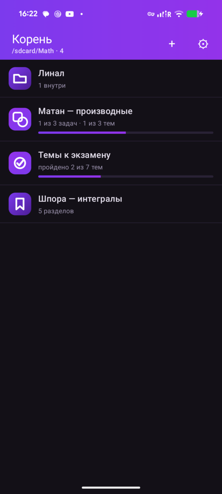
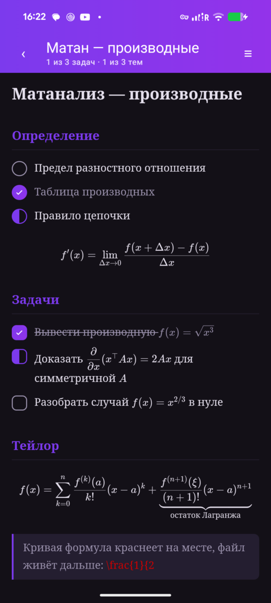
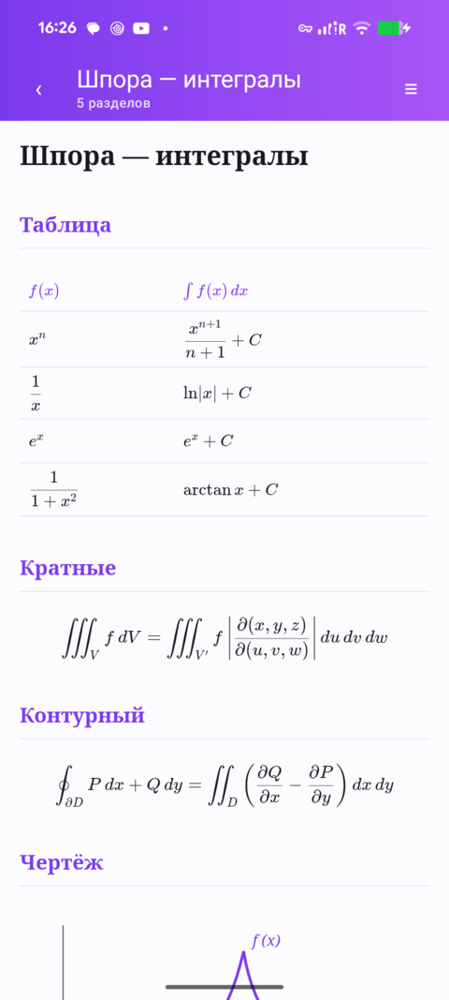
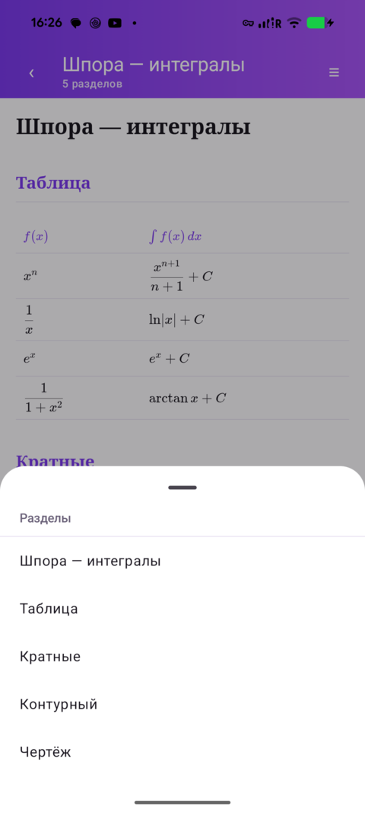
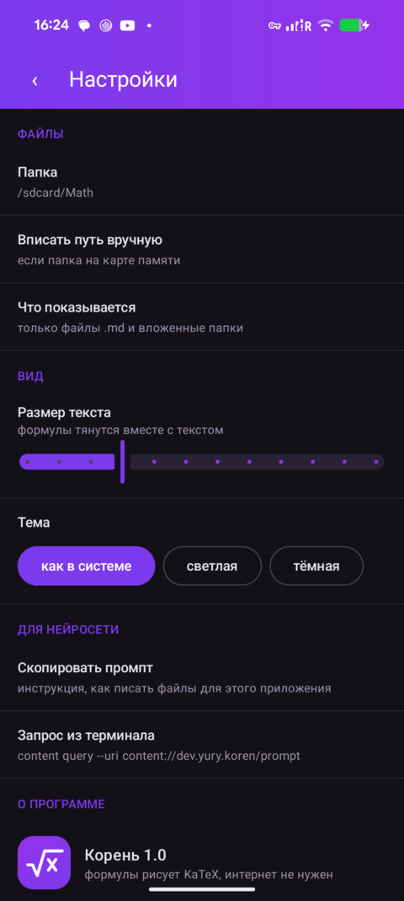
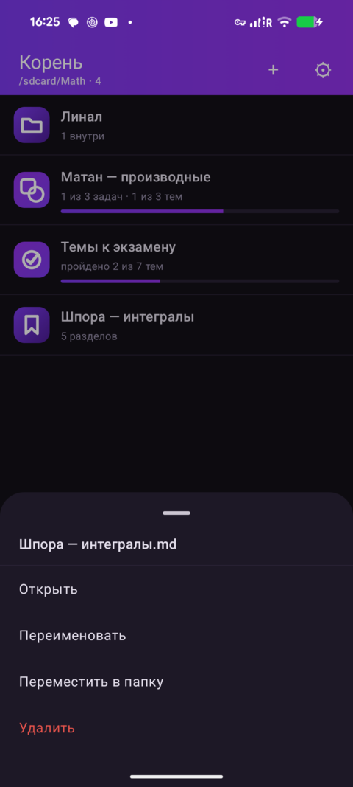

# Корень

Приложение под Android: показывает `.md` файлы с математикой из выбранной папки
и рисует формулы так, как их печатают в учебниках — интегралы, матрицы, дроби,
корни. Задачи и темы отмечаются тапом, при этом в файле меняется **ровно один
символ**.

Интернет не нужен: движок формул лежит внутри приложения.

## Зачем

Задачи и шпоры удобно писать текстом — своими руками или нейросетью, — но
читать их потом негде. Obsidian тяжёлый и превращает файл в свою базу; обычные
читалки markdown показывают `\int_0^1 \frac{dx}{x}` как есть, набором закорючек;
PDF из LaTeX верстается под лист A4 и на телефоне его приходится щипать пальцами.

Нужен был узкий инструмент: **показать математику красиво и дать отметить
пройденное**. Всё остальное по умолчанию не делается.

## Как выглядит

| | |
|---|---|
|  |  |
| Список файлов: значок зависит от того, что внутри | Чтение: формулы, задачи, темы |
|  |  |
| Светлая тема | Оглавление — прыжки по разделам |
|  |  |
| Настройки | Долгое нажатие: действия с файлом |

## Формат файлов

Обычный markdown. Формулы — языком LaTeX между долларами:

```markdown
# Матанализ — производные

## Определение

- ( ) Предел разностного отношения      ← ТЕМА, круглые скобки
- (x) Таблица производных

$$f'(x) = \lim_{\Delta x \to 0} \frac{f(x + \Delta x) - f(x)}{\Delta x}$$

## Задачи

- [x] Вывести производную $f(x)=\sqrt{x^3}$    ← ЗАДАЧА, квадратные скобки
- [~] Доказать $\dfrac{\partial}{\partial x}(x^{\top}Ax) = 2Ax$
- [ ] Разобрать случай $f(x)=x^{2/3}$ в нуле
```

**Скобки задают смысл.** Квадратные — задача, её делают один раз, отмеченная
перечёркивается. Круглые — тема, её изучают, пройденная не перечёркивается,
а гаснет: знание не вычёркивают.

**Три состояния** у обеих: `[ ]` не начато, `[~]` в работе, `[x]` готово.
Тап по значку переключает их по кругу.

Тип файла объявлять не нужно — приложение считает строки само и по итогу
выбирает значок в списке: задачник, список тем, смешанный файл или справочник.

Графики и чертежи — встроенным `<svg>` прямо в файле. Ссылок наружу быть не
должно, интернета у приложения нет.

Полная инструкция для нейросети лежит внутри приложения: **Настройки →
Скопировать промпт**.

## Главное правило

Приложение **не перезаписывает файл целиком**. Отметка находит смещение символа
между скобками и заменяет один байт: пробел на `~`, `~` на `x`, `x` обратно на
пробел. Все остальные байты — отступы, пустые строки, регистр, порядок строк —
остаются нетронутыми.

Это важно, потому что те же файлы правит Claude Code с телефона через терминал.
Если бы приложение разбирало файл в модель и собирало обратно, оно нормализовало
бы форматирование и правки со стороны терминала поехали бы.

Логика вынесена в `MdItems.kt` и покрыта юнит-тестами (`MdItemsTest.kt`) — в том
числе проверкой, что после отметки в байтах UTF-8 отличается ровно один байт.

## Никакого скрытого состояния

Всё, что делает приложение, можно сделать текстом, и наоборот:

| Что | Где живёт |
|---|---|
| отметки | в самих файлах `.md` |
| настройки | `/data/data/dev.yury.koren/files/koren.conf`, обычный текст |
| список файлов | сама папка, реестра внутри приложения нет |
| инструкция для нейросети | внутри приложения, отдаётся по запросу |

Своей базы нет. Приложение и терминал не мешают друг другу.

## Запрос из терминала

Инструкцию можно получить прямо из приложения, без рута и без файлов на диске:

```bash
content query --uri content://dev.yury.koren/prompt
```

Наружу отдаётся только текст промпта — тот же, что под кнопкой в настройках.
Ни файлов, ни настроек через этот путь не отдаётся и не меняется.

## Что умеет

| | |
|---|---|
| Тап по значку | переключить состояние, запись в файл сразу |
| Тап по файлу | открыть чтение |
| Долгое нажатие | открыть, переименовать, переместить, удалить |
| Кнопка «+» | создать папку |
| Значок «≡» | оглавление по разделам `##` |
| Настройки | папка, размер текста, тема, промпт |

Формулы: дроби, корни любой степени, интегралы кратные и контурные, суммы и
произведения с пределами, матрицы и определители, системы, многострочные
выкладки, греческие буквы, множества, кванторы, тензорные индексы, цепные дроби,
надчёркивания и скобки под группой членов. Не покрываются только чертежи —
для них `<svg>`.

## Данные

Папка `/sdcard/Math`, настраивается. Приложение видит в ней файлы `.md` и
вложенные папки, файлы по именам не знает — положишь новый, появится сам.

Кодировка UTF-8, переводы строк LF. Запись атомарная: во временный файл, затем
переименование, — разряд батареи посреди записи не оставит обрезанный файл.

## Сборка

Нужны JDK 21 и Android SDK (`~/Android/Sdk`, платформа 37, средства сборки 36).

```bash
cd android
gradle :app:testDebugUnitTest    # тесты побайтовой правки
gradle :app:assembleRelease
adb install -r app/build/outputs/apk/release/app-release.apk
```

Доступ к файлам вне песочницы выдаётся один раз. С рутом — молча:

```bash
adb shell 'su -c "appops set dev.yury.koren MANAGE_EXTERNAL_STORAGE allow"'
```

Без рута приложение покажет кнопку, открывающую нужный экран настроек.

Готовый APK лежит в `apk/` и в разделе Releases.

## Устройство проекта

```
android/app/src/main/java/dev/yury/koren/
  MdItems.kt          разбор задач и тем, побайтовая правка (без Android)
  FilesRepo.kt        папки, файлы, атомарная запись
  Settings.kt         настройки текстовым файлом
  Prompt.kt           инструкция для нейросети
  PromptProvider.kt   отдаёт инструкцию по запросу из терминала
  Theme.kt            цвета, светлая и тёмная
  Glyph.kt            значки: задачник, темы, смешанный, справочник, папка
  MainActivity.kt     состояние и переходы между экранами
  ListScreen.kt       список папки, шторка действий
  DocScreen.kt        чтение: шапка, оглавление, мост со страницей
  SettingsScreen.kt   настройки
android/app/src/main/assets/
  reader.html         страница чтения: вёрстка и типографика
  reader.js           разбор markdown и отрисовка формул
  katex/              движок формул, работает без интернета
android/app/src/test/ юнит-тесты побайтовой правки
```

## Стек

Kotlin, Jetpack Compose, KaTeX в WebView, AGP 9.3.1, Compose BOM 2026.06.01,
minSdk 30, target 37. Отдельного плагина `kotlin.android` нет — AGP 9 умеет
Kotlin сам.

Формулы рисует KaTeX — тот же движок, что в вебе, шрифтом Computer Modern.
Свой рендер формул не писался намеренно: растягивание скобок по высоте,
размеры дробей по уровням вложенности и интервалы между знаками — это работа
на годы, и она уже сделана.

## Лицензия

MIT, файл `LICENSE`.
