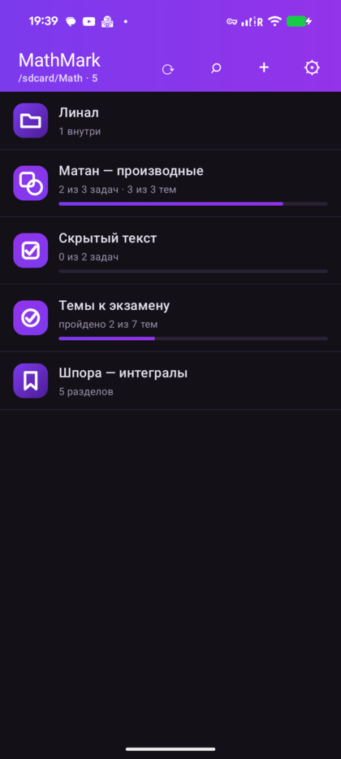
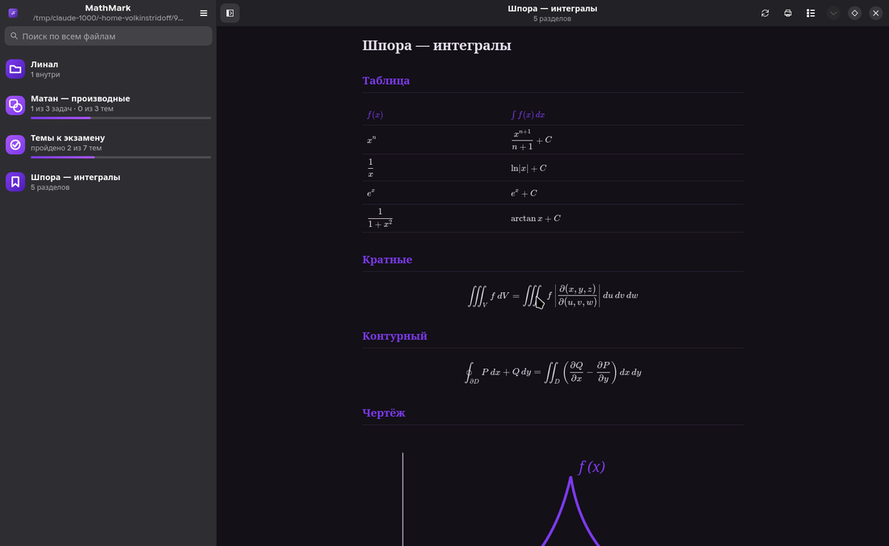
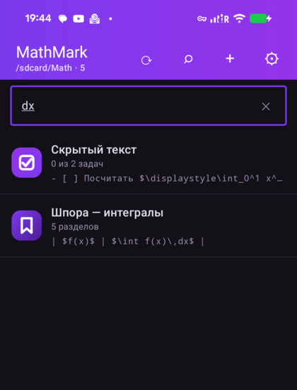
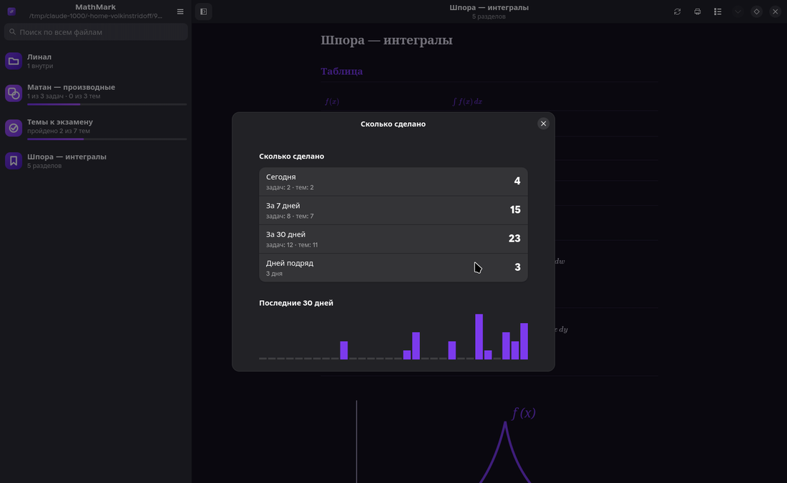

<div align="center">


# MathMark

**Читалка математики в файлах Markdown — для телефона и для компьютера.**

Формулы выглядят так, как их печатают в учебниках.
Отметка задачи меняет в файле ровно один байт.

[English](README.md) · [Español](README.es.md)

  



</div>

---

## Зачем

Математику удобно **писать** обычным текстом — руками или нейросетью. Ломается всё на чтении.

Обычные читалки markdown показывают `\int_0^1 \frac{dx}{x}` набором закорючек. Системы заметок вроде Obsidian и Joplin формулы рисуют, но хотят владеть твоими записями: хранилище, база, учётная запись. PDF, собранный из LaTeX, свёрстан под лист A4 — на телефоне его приходится бесконечно щипать пальцами.

MathMark делает две вещи и наотрез отказывается делать больше: **показать математику по-человечески и дать отметить пройденное.**

## Скачать

| | |
|---|---|
| **Android** | [Releases](../../releases) → `mathmark-1.0.apk` |
| **Linux** | [Releases](../../releases) → `mathmark-1.0.flatpak` или запуск из исходников |

Ни учётной записи, ни интернета, ни слежки. Движок формул лежит внутри приложения.

## Как выглядит файл

Обычный markdown. Формулы языком LaTeX между долларами.

```markdown
# Матанализ — производные

## Темы

- ( ) Предел разностного отношения
- (x) Таблица производных
- (~) Правило цепочки

$$f'(x) = \lim_{\Delta x \to 0} \frac{f(x + \Delta x) - f(x)}{\Delta x}$$

## Задачи

- [x] Вывести производную $f(x)=\sqrt{x^3}$
- [ ] Доказать $\dfrac{\partial}{\partial x}(x^{\top}Ax) = 2Ax$

Ответ можно спрятать: ||$f'(x) = \tfrac{3}{2}\sqrt{x}$|| — открывается нажатием.
```

**Скобки задают смысл.**
`[ ]` — **задача**: делают один раз, отмеченная перечёркивается.
`( )` — **тема**: её изучают, и пройденная тема **не** перечёркивается, а просто гаснет. Знание не вычёркивают.

У обеих **три состояния**: `[ ]` не начато, `[~]` в работе, `[x]` готово. Нажатие переключает их по кругу.

Тип файла нигде не объявляется. Приложение считает строки само и по итогу выбирает значок: задачник, список тем, смешанный файл или справочник.

## Что умеет

<div align="center">
   
</div>

- **Настоящие формулы.** Дроби, корни любой степени, кратные и контурные интегралы, суммы и произведения с пределами, матрицы и определители, системы, многострочные выкладки, греческие буквы, множества и кванторы, тензорные индексы, цепные дроби, скобки под группой членов. Рисует [KaTeX](https://katex.org) шрифтом Computer Modern — тем самым, которым набраны учебники.
- **Скрытый текст.** Любой кусок в `||двойных палках||` превращается в плашку, которая открывается нажатием. Ответы, подсказки, определения — всё, что стоит вспомнить самому, прежде чем подсмотреть.
- **Поиск по всем файлам** — по именам и по содержимому, с показом найденной строки.
- **Оглавление** по заголовкам `##` — так листают длинную шпору.
- **Прогресс.** Сколько закрыто сегодня, за неделю, за месяц, сколько дней подряд, и столбики за тридцать дней. Считается по журналу отметок, то есть по времени, **когда ты решил**, а не когда нажал синхронизацию.
- **Напоминания**, навешенные на файл, а не вписанные в него. Свой текст, каждый день / каждую неделю / один раз. По нажатию открывается тот самый файл.
- **Синхронизация через GitHub** одной кнопкой. Отметки с двух устройств сводятся, выигрывает более продвинутое состояние. Настоящий спор о тексте не решается за твоей спиной: своё остаётся, чужое ложится рядом.
- **Чертежи** встроенным `<svg>` — график едет внутри самого файла.
- **Три языка**: English, Русский, Español.

## Правило, из которого растёт всё остальное

Приложение **не переписывает файл.** Отметка находит смещение символа между скобками и заменяет **один байт**: пробел → `~` → `x` → пробел. Все прочие байты — отступы, пустые строки, регистр, порядок строк — остаются нетронутыми, длина файла не меняется.

Это важно, если те же файлы правятся из терминала, редактора или помощником. Программа, которая разобрала бы файл в модель и собрала обратно, нормализовала бы форматирование и тихо откатила чужую работу.

Логика живёт в `MdItems.kt` и `md_items.py` и покрыта тестами — в том числе проверкой, что после отметки в UTF-8 отличается ровно один байт.

## От терминала ничего не спрятано

Своей базы нет. Всё, что приложение знает, лежит в файлах, которые можно прочитать и поправить:

| Что | Где |
|---|---|
| отметки | в самих файлах `.md` |
| настройки | `~/.config/mathmark/mathmark.conf`, обычный текст |
| список файлов | сама папка, внутреннего реестра нет |
| журнал отметок | `journal.log`, только дописывается |
| напоминания | `reminders.conf`, обычный текст |

Значит, всё, что ты делаешь руками, может сделать и скрипт или помощник в терминале — и наоборот. Правишь файл снаружи — открытый документ перечитывается сам.

Приложение ещё и отдаёт собственную инструкцию по запросу, чтобы формат не приходилось никуда копировать:

```bash
content query --uri content://dev.yury.mathmark/prompt
```

На компьютере тот же текст лежит под кнопкой в настройках. В нём описаны скобки, три состояния, скрытый текст, формулы и чертежи — отдай его нейросети, и файлы отрисуются правильно с первого раза.

## Настольная версия

<div align="center">
 
</div>

Это та же программа, и рисует она **через ту же самую страницу**, что и телефон: `shared/reader/` используется обеими, разъехаться они не могут.

Что добавляет большой экран: две колонки, поиск по всем файлам, клавиатура (`j`/`k` или стрелки по строкам, пробел — отметить), печать и сохранение шпоры в PDF, слежение за папкой — правишь файл в редакторе, окно обновляется само. Колонка текста держит читаемую ширину: растягиваешь окно — растут поля, а не строка.

```bash
./desktop/install.sh     # запускалка в ~/.local/bin, значок и пункт в меню
mathmark
```

Нужны `gtk4`, `libadwaita`, `webkitgtk-6.0`, `python-gobject`.

## Сборка

**Android** — JDK 21 и Android SDK (платформа 37):

```bash
cd android
gradle :app:testDebugUnitTest
gradle :app:assembleRelease
adb install -r app/build/outputs/apk/release/app-release.apk
```

Приложение читает обычную папку в общей памяти, поэтому один раз просит доступ ко всем файлам. С рутом его можно выдать молча:

```bash
adb shell 'su -c "appops set dev.yury.mathmark MANAGE_EXTERNAL_STORAGE allow"'
```

**Компьютер** — `python3 -m pytest desktop/tests`

На обеих сторонах одни и те же 51 проверка: одинаковые правила разбора, отметки, сведения версий, статистики и напоминаний. Разъедутся — тесты упадут.

## Устройство

```
shared/          общее для обеих версий
  reader/        страница чтения, её вёрстка и KaTeX
  prompt/        инструкция для нейросетей
  i18n/          переводы, по одному JSON на язык
android/         Kotlin, Jetpack Compose
desktop/         Python, GTK4, libadwaita
```

## Лицензия

MIT. Делай что хочешь.
